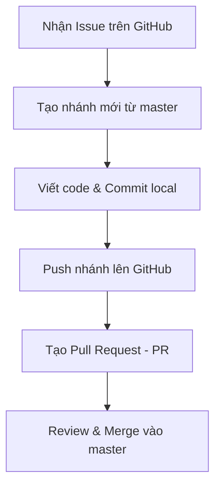

#  Hướng dẫn đóng góp dự án (Contributing Guide)

Chào mừng các thành viên nhóm **3HD2Kcinema**! Để đảm bảo quá trình phát triển diễn ra trơn tru, hạn chế xung đột code (conflict) và quản lý tiến độ hiệu quả, tất cả thành viên cần tuân thủ quy trình làm việc dưới đây.

---

##  Quy trình phát triển (Git Workflow)

Chúng ta sử dụng quy trình **GitHub Flow** (phát triển qua Pull Request nhánh tính năng). Quy trình gồm các bước:



### Bước 1: Nhận công việc (Issue)
1. Truy cập mục **Issues** trên GitHub.
2. Chọn Issue liên quan đến tính năng (User Story) bạn chuẩn bị làm.
3. Gán (Assign) issue đó cho chính mình và chuyển trạng thái sang **In Progress** (nếu có Project Board).

### Bước 2: Tạo nhánh mới (Feature Branch)
*Trước khi tạo nhánh mới, luôn cập nhật nhánh `master` local mới nhất:*
```bash
git checkout master
git pull origin master
```
*Tạo nhánh mới để làm tính năng theo quy tắc đặt tên:*
*   Tính năng mới: `feature/usXX-ten-tinh-nang` (Ví dụ: `feature/us01-cinematic-ui`)
*   Sửa lỗi: `bugfix/usXX-ten-loi` (Ví dụ: `bugfix/us02-seat-locking-error`)

```bash
git checkout -b feature/us01-cinematic-ui
```

### Bước 3: Viết code & Commit
*   Triển khai mã nguồn theo yêu cầu của User Story.
*   Nên chia nhỏ công việc để commit nhiều lần thay vì viết tất cả rồi mới commit 1 lần.
*   **Thông điệp commit (Commit Message):** Nên tuân thủ chuẩn **Conventional Commits**:
    *   `feat: ...` cho tính năng mới (Ví dụ: `feat: add movie listing page UI`)
    *   `fix: ...` cho sửa lỗi (Ví dụ: `fix: resolve socket.io disconnect bug`)
    *   `docs: ...` cho cập nhật tài liệu (Ví dụ: `docs: update setup guide`)
    *   `style: ...` cho định dạng code, CSS (không thay đổi logic)

### Bước 4: Push nhánh lên GitHub
Sau khi hoàn tất tính năng và kiểm tra code hoạt động ổn định local, tiến hành push nhánh của bạn lên remote:
```bash
git push origin feature/us01-cinematic-ui
```

### Bước 5: Tạo Pull Request (PR)
1. Truy cập kho lưu trữ GitHub của dự án, bạn sẽ thấy gợi ý tạo Pull Request cho nhánh vừa push.
2. Nhấn **Compare & pull request**.
3. **Nội dung PR:**
   * Viết mô tả ngắn gọn những gì bạn đã làm.
   * **RẤT QUAN TRỌNG:** Ở phần mô tả PR, viết `Closes #<ID_của_Issue>` (Ví dụ: `Closes #1`). Việc này giúp GitHub tự động đóng Issue tương ứng sau khi PR được merge vào `master`.
4. Yêu cầu ít nhất 1 thành viên khác trong nhóm review code.

### Bước 6: Review, Giải quyết Conflict & Merge
*   Người review sẽ đọc code, chạy thử (nếu cần) và để lại ý kiến đóng góp.
*   Nếu có conflict với nhánh `master`, thực hiện rebase hoặc merge `master` vào nhánh của bạn để giải quyết dưới local trước khi merge PR:
    ```bash
    git checkout master
    git pull origin master
    git checkout feature/us01-cinematic-ui
    git merge master # Giải quyết conflict tại đây nếu có
    git push origin feature/us01-cinematic-ui
    ```
*   Sau khi PR được duyệt và không còn conflict, tiến hành **Merge pull request** trên giao diện GitHub.
*   Xóa nhánh tính năng trên GitHub sau khi đã merge thành công.

---

##  Quy tắc an toàn (Best Practices)

1.  **KHÔNG bao giờ commit trực tiếp lên nhánh `master`**. Mọi thay đổi đều phải đi qua Pull Request.
2.  **Kéo code mới về thường xuyên:** Trước khi bắt đầu ngày làm việc mới, hãy pull code từ `master` về để tránh bị lệch code quá xa so với tiến độ chung của nhóm.
3.  **Clean Code:** 
    *   Giữ code sạch sẽ, gọn gàng, xóa các dòng debug (`console.log`) không cần thiết trước khi commit.
    *   Tự kiểm tra lint/format định dạng code của dự án.
4.  **Tài liệu đi kèm:** Nếu tính năng của bạn yêu cầu thay đổi cấu trúc thư mục hoặc cách chạy dự án, hãy cập nhật vào tài liệu hướng dẫn tương ứng.
