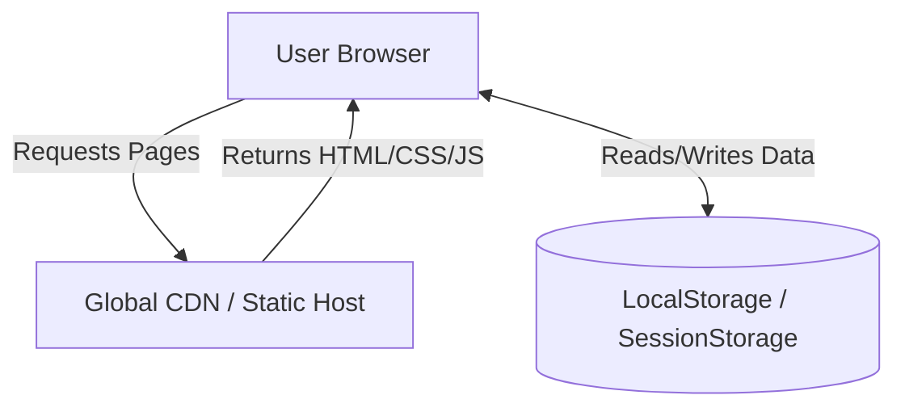

# Deployment Architecture

## Overview

Since 3HD2Kcinema is built entirely using vanilla HTML, CSS, and JavaScript, the deployment architecture is simplified to hosting static client-side files. There are no backend servers, database systems, or API gateways to deploy or maintain.

Deployment architecture focuses on:

* zero-cost static hosting
* global Content Delivery Networks (CDNs) for assets
* rapid continuous deployment (CI/CD) via Git integrations
* ease of access (anyone can open the app instantly)

---

# Hosting Platforms

The application can be hosted on any static hosting provider. Recommended platforms:

* **GitHub Pages**: Ideal for portfolio projects, free, and integrated directly into GitHub repositories.
* **Vercel**: Provides fast global CDN edge delivery and simple repository integration.
* **Netlify**: Excellent drag-and-drop or Git-based deployment for static projects.

---

# Deployment Goals

The deployment setup should:

* require no backend runtime configuration
* automatically deploy updates when changes are pushed to the repository branch
* run fast with zero cold-starts
* load all data structures locally on the user's browser client

Avoid:

* renting servers or paying database hosting fees
* complex build toolchains (like webpack or custom rollup setups) unless explicitly needed

---

# Static File Distribution Diagram

---

# GitHub Pages Deployment Workflow

To deploy using GitHub Pages:

1. **Commit and Push**: Ensure the root workspace files (`index.html`, `login.html`, `js/`, `css/`, `Docs/`) are pushed to the main branch of your GitHub repository.
2. **Configure Settings**:
   - Go to your GitHub repository -> Settings -> Pages.
   - Under **Build and deployment**, select **Deploy from a branch**.
   - Choose the branch (e.g., `main` or `develop`) and folder (usually `/root`).
   - Click **Save**.
3. **Access URL**: Within 1-2 minutes, GitHub will publish the site at `https://<your-username>.github.io/<repository-name>/`.

---

# Vercel Static Deployment Workflow

To deploy using Vercel:

1. **Import Project**: Log in to Vercel and import your GitHub repository.
2. **Build Settings**:
   - Vercel automatically detects the project as static.
   - Set the build command to empty/none.
   - Set the output directory to `./` (root).
3. **Deploy**: Click **Deploy**. Vercel will create a custom domain (e.g. `3hd2kcinema.vercel.app`) with automatic SSL enabled.

---

# Data Persistence Considerations

* **Local Scope**: Data stored in `LocalStorage` is tied to the specific protocol and domain name (e.g., `https://username.github.io`).
* **Cross-Tab Synchronization**: The `BroadcastChannel` API works perfectly across all open tabs on the deployed static domain, keeping seat locks and states in sync.
* **Database Reset**: Since data is client-side, clearing the browser cache/site data will reset the application to its default state. This can be useful for debugging or restarting user simulations.
