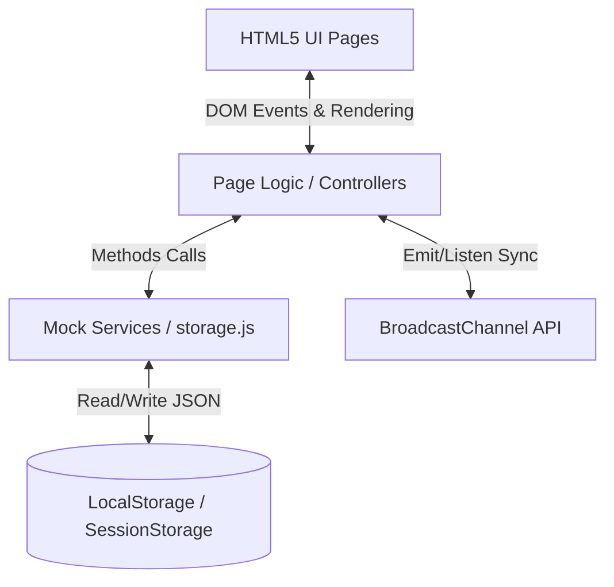

# Architecture Overview

## System Overview

3HD2Kcinema is a client-side vanilla cinema booking web application. It allows users to browse movies, select showtimes, select seats, and purchase tickets entirely within the user's browser. The application follows a modular client-side architecture where HTML pages are rendered dynamically using JavaScript, styled with vanilla CSS, and synchronized across multiple browser tabs using the browser's native `BroadcastChannel` API. Data persistence is managed locally via `LocalStorage`.

## Component Diagram



## Data Flow

1. **User Interaction**: A user visits `index.html`, which runs `js/pages/index.js` to load the movie catalog from `js/services/movieService.js`. The DOM is dynamically updated with movie cards.
2. **Showtime & Seating**: The user clicks a movie, navigating to `booking.html?movie=ID`. The page script renders the room seating grid.
3. **Seat Selection (Multi-tab Synchronization)**:
   - When the user clicks a seat, the script calls `bookingService.js` to lock it in `LocalStorage`.
   - The script emits a `LOCK_SEAT` event via the `BroadcastChannel` named `3hd2k_seat_channel`.
   - Other tabs viewing the same showtime receive the event and mark the seat as unavailable.
4. **Checkout & Persistence**:
   - The user selects seat(s) and combo packages, navigating to the payment simulation screen.
   - Upon confirming payment, `bookingService.js` writes a new booking record to `LocalStorage` under `3hd2k_bookings` and updates the showtime seats list to `booked`.
   - A `BOOK_SEAT` event is broadcasted to clear active locks and establish the permanent booking state across all active tabs.

## Key Abstractions

- **Storage Wrapper (`js/services/storage.js`)**: Handles read/write actions, JSON serialization, and error recovery for browser storages.
- **Authentication Service (`js/services/authService.js`)**: Manages user registrations and active sessions in SessionStorage.
- **Movie Service (`js/services/movieService.js`)**: Retrieves movie profiles and calculates showtime schedules.
- **Booking Service (`js/services/bookingService.js`)**: Evaluates seat availability, handles lease lock durations, and triggers simulation loops for other users.
- **Page Handlers (`js/pages/`)**: Standard JS scripts responsible for DOM events, input validation, and rendering layouts.

## Directory Structure Rationale

The project keeps code simple and organized without needing a build framework:

```text
3hd2kcinema/
├── css/                 # Vanilla stylesheets
│   └── style.css
├── js/                  # Application Logic (ES6 Modules)
│   ├── components/      # UI components (Navbar, MovieCard, SeatGrid)
│   ├── services/        # Storage wrappers and simulated backend services
│   ├── pages/           # Page controllers (index, login, booking, profile)
│   └── main.js          # App bootstrapper
├── docs/                # Project documentation
├── index.html           # Home page
├── login.html           # User authentication login page
├── register.html        # User registration page
├── profile.html         # Profile and admin dashboard page
└── booking.html         # Seat selection and showtime page
```
