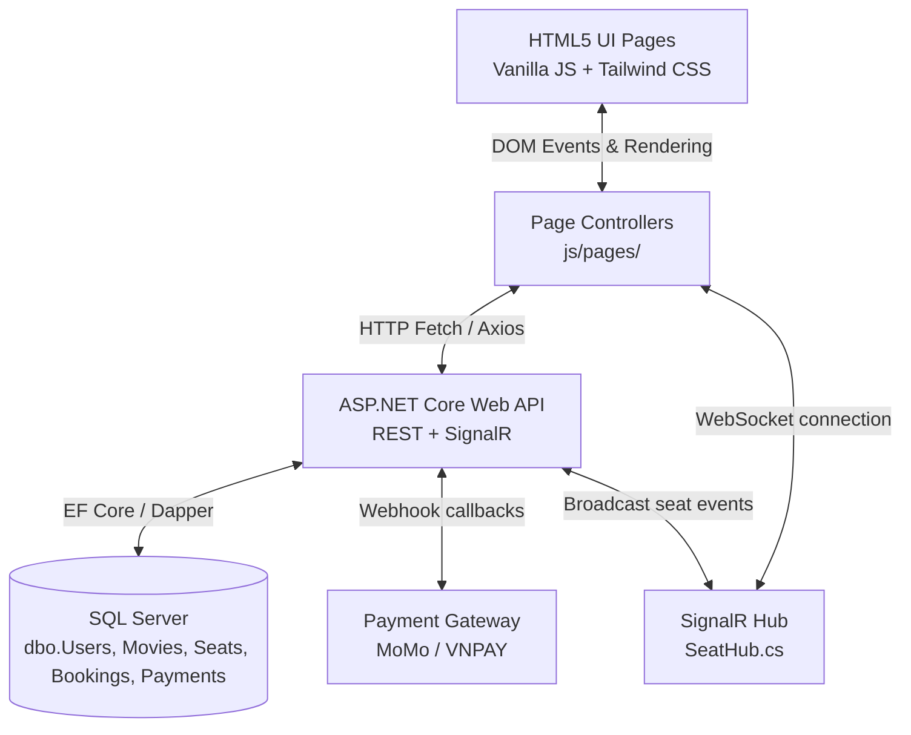

# Architecture Overview

## System Overview

3HD2Kcinema is a **client-server cinema booking web application**. The frontend is built with Vanilla HTML/CSS/JavaScript and communicates with a **RESTful ASP.NET Core Web API** backend. All application data is persisted in a **Microsoft SQL Server** database. Real-time seat synchronization across clients is handled by **SignalR**.

---

## Component Diagram



---

## Data Flow

1. **User Interaction**: A user visits `index.html`. The page script calls `GET /api/movies` and renders the movie catalog from the API response.

2. **Showtime & Seating**: The user navigates to `booking.html?showtimeId=st_200`. The page calls `GET /api/showtimes/st_200/seats`, which queries `dbo.Seats` and returns the current seat map.

3. **Seat Selection (Real-time Synchronization)**:
   - The user clicks a seat. The script calls `POST /api/bookings/lock` with `{ showtimeId, seatLabel, userId }`.
   - The backend executes an atomic `UPDATE dbo.Seats SET Status = 'locked' WHERE Status = 'available'`.
   - On success, `SeatHub` broadcasts `{ type: "SEAT_LOCKED", seatLabel, showtimeId }` to all connected clients on that showtime room.
   - Other users' browsers receive the SignalR event and mark the seat as unavailable in their UI.

4. **Checkout & Payment**:
   - The user selects a combo and payment method, then calls `POST /api/payments/create`.
   - The backend creates a `pending` row in `dbo.Payments` and returns a MoMo / VNPAY redirect URL.
   - After the user completes payment, the provider sends a webhook to `POST /api/payments/callback`.
   - The backend verifies the HMAC signature, then runs a SQL transaction to update `dbo.Payments`, `dbo.Bookings`, and `dbo.Seats` atomically.

5. **QR Ticket**:
   - On confirmed payment, the backend stores the full `QrString` in `dbo.Bookings.QrString`.
   - The frontend retrieves the booking via `GET /api/bookings/{id}` and renders the QR code client-side using `qrcode.js`.
   - Ticket data is cached in `LocalStorage` so the invoice page works offline.

---

## Key Abstractions

| Layer | Responsibility |
|---|---|
| **Page Controllers** (`js/pages/`) | DOM events, rendering, calling API endpoints |
| **API Controllers** (`Controllers/`) | Request routing, input validation, HTTP responses |
| **Services** (`Services/`) | Business logic, SQL operations via EF Core / Dapper |
| **AppDbContext** | EF Core database connection and entity mapping |
| **SeatHub** (SignalR) | Real-time broadcast of seat lock/unlock/book events |
| **LocalStorage** (browser) | Offline ticket cache only — not the primary data store |

---

## Directory Structure

```text
3hd2kcinema/
├── src/                         # Frontend (static files)
│   ├── assets/
│   │   └── css/style.css
│   ├── js/
│   │   ├── pages/               # Page controllers (index, login, booking, checkout...)
│   │   └── services/            # API client wrappers (apiClient.js, authService.js...)
│   ├── index.html
│   ├── login.html
│   ├── register.html
│   ├── profile.html
│   ├── booking.html
│   ├── checkout.html
│   ├── payment_simulation.html
│   └── booking_invoice.html
│
├── backend/                     # ASP.NET Core Web API
│   ├── Controllers/
│   ├── Services/
│   ├── Models/
│   ├── Data/
│   │   └── AppDbContext.cs
│   ├── Hubs/
│   │   └── SeatHub.cs
│   └── appsettings.json         # SQL Server connection string, JWT secret
│
└── Docs/                        # Project documentation
```
