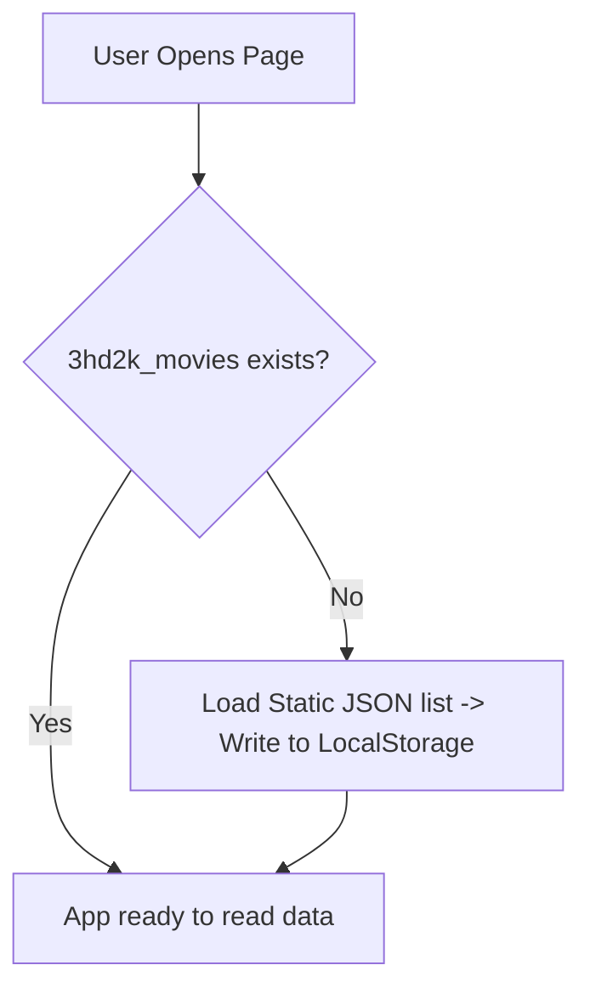

# Database Design (Browser Storage)

## Overview

3HD2Kcinema operates entirely server-free, using browser-native storage APIs as its database engine. 

The database architecture focuses on:
* **Zero Overhead**: Direct read/write capability without databases to run or install.
* **JSON Serialization**: Storing arrays and dictionaries serialized as strings.
* **Auto Seeding**: Populating mock movie, room, and showtimes catalog when the user first loads the app.

---

# Storage Types

## LocalStorage (`localStorage`)
Used for long-term database tables that should persist even if the browser is closed or restarted:
* **Users** (`3hd2k_users`)
* **Movies** (`3hd2k_movies`)
* **Showtimes** (`3hd2k_showtimes`)
* **Bookings** (`3hd2k_bookings`)
* **Payments** (`3hd2k_payments`)

## SessionStorage (`sessionStorage`)
Used for short-term data tied to the active browser tab session:
* **Active User Session** (`3hd2k_current_user`): Tracks user login details.
* **Pending Selection** (`3hd2k_pending_booking`): Temporarily stores cart data during checkout redirects.

---

# Data Seeding Workflow

To provide a working demonstration out of the box, `storage.js` runs a seeding script when loaded:



---

# Indexing & Query Optimizations

Since browser storage lacks secondary indexes, JavaScript handles lookup improvements in the service layer:
* **Fast Primary Lookup**: When searching by ID, use `.find(x => x.id === targetId)`.
* **Indexed Map Cache**: For high-frequency lookups (like checking seat locks), convert arrays to keyed objects in memory:
  ```javascript
  const movieMap = new Map(movies.map(m => [m.id, m]));
  ```

---

# Security & Data Safety

* **No Encryption**: LocalStorage contains plain JSON string text. Never store real credit cards, production passwords, or personal credentials.
* **Validation**: Input fields (e.g., registration emails, booking seats) are validated against existing records in the LocalStorage arrays before performing writes.
* **Clearing Database**: Developers and users can clean the database instantly by calling `localStorage.clear()` in the browser developer console or clearing browser site cookies.
