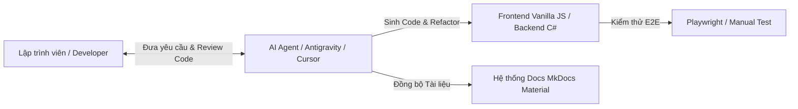

# Quy định & Hướng dẫn Sử dụng AI (AI Contribution & Agent Guide)

Tài liệu này định nghĩa chính thức toàn bộ các quy định, chính sách và quy trình kỹ thuật dành cho lập trình viên và các **AI Agent** (Google Antigravity, Cursor, GitHub Copilot) khi tương tác với mã nguồn và tài liệu của dự án **3HD2Kcinema**.

---

## 🎯 1. Vai trò & Triết lý Sử dụng AI (AI Philosophy)

AI trong dự án 3HD2Kcinema đóng vai trò là một **Trợ lý Lập trình (Pair Programmer)** cao cấp. AI giúp tăng tốc độ phát triển, duy trì tính nhất quán của kiến trúc và đồng bộ tài liệu, nhưng không thay thế sự kiểm duyệt và trách nhiệm kỹ thuật của lập trình viên.



### Nguyên tắc Cốt lõi (Core Principles):
1. **Code Đơn giản & Dạng Module**: Sử dụng thuần Vanilla ES6 Modules (`import`/`export`), thiết kế giao diện theo từng miền tính năng (Domain-Based), mã nguồn sạch sẽ và dễ bảo trì.
2. **Tuyệt đối TRÁNH Over-Engineering**: Không tự ý cài đặt thêm các framework hoặc bundler phức tạp (React, Vue, Webpack, Vite, Babel) vào phân hệ Frontend Vanilla JS trừ khi có chỉ thị trực tiếp từ lập trình viên.
3. **Code dễ đọc hơn code thông minh**: Ưu tiên sự rõ ràng, giữ nguyên tất cả comment/docstring hiện có và không abstract hóa quá mức.

---

## 🛡️ 2. Chính sách Sử dụng AI (AI Usage Policy - DOs & DON'Ts)

!!! tip "Dành cho Lập trình viên & AI Agent"
    Tuân thủ bảng quy tắc dưới đây để đảm bảo chất lượng mã nguồn và tránh phát sinh xung đột trong quá trình phát triển.

### ✅ Những điều NÊN LÀM (DOs)

- **Đồng bộ hóa Tài liệu**: Mỗi khi thêm/sửa tính năng hoặc cấu trúc dữ liệu, AI Agent **phải tự động cập nhật** các tệp tài liệu `.md` tương ứng trong thư mục `docs/`.
- **Tạo Cấu trúc Mẫu (Boilerplate)**: Sử dụng AI để sinh nhanh các mẫu trang HTML, module Javascript, DTO C# hoặc các bảng SQL Schema.
- **Tối ưu & Tách nhỏ Code (Refactoring)**: Sử dụng AI để tách các tệp JS quá lớn thành các module Controller/Service nhỏ hơn theo nguyên tắc Clean Code.
- **Phân tích & Tìm nguyên nhân Lỗi (Root Cause Debugging)**: Yêu cầu AI giải thích *tại sao* lỗi xảy ra (nguyên nhân gốc rễ) trước khi áp dụng giải pháp sửa lỗi.
- **Hỗ trợ Viết Test**: Dùng AI để sinh các kịch bản kiểm thử E2E Playwright (`tests/e2e/`).

### ❌ Những điều KHÔNG ĐƯỢC LÀM (DON'Ts)

- **Không tạo tính năng quá lớn trong 1 lần Prompt**: Không yêu cầu AI sinh ra toàn bộ luồng nghiệp vụ phức tạp cùng lúc. Hãy chia nhỏ thành các bước: *Giao diện UI -> Mock Service -> Xử lý Event -> Đóng gói Hóa đơn*.
- **Không tự ý cài đặt Dependencies**: Không cài các thư viện ngoài khi có thể giải quyết bằng JavaScript/CSS nguyên bản (Native HTML5/CSS3/Vanilla JS).
- **Không phá vỡ API & Storage Contract**: Không tự ý đổi tên các storage key (`cinema_users`, `cinema_checkout`, `cinema_seat_locks`) hoặc signature của các hàm wrapper trong `storage.js`.
- **Không che giấu lỗi thủ công**: Không sửa lỗi test bằng cách comment out các bài test Playwright đang thất bại hoặc bọc ngoại lệ bằng `catch` rỗng.

---

## 💻 3. Quy định Kỹ thuật dành riêng cho AI Agent

Khi AI Agent thao tác với codebase, phải tuân thủ nghiêm ngặt các quy tắc kiến trúc sau:

### Phân hệ Frontend (Client-side Engine)
- **Tệp HTML**: Sử dụng thẻ ngữ nghĩa Semantic HTML5. Khai báo Script dạng module: `<script type="module" src="./controller.js"></script>`.
- **Thao tác Storage**: **TUYỆT ĐỐI KHÔNG** gọi trực tiếp `localStorage.getItem()` hay `localStorage.setItem()` rải rác. Mọi truy xuất phải thông qua wrapper:
  ```javascript
  import { Storage, KEYS } from '../shared/utils/storage.js';
  const user = Storage.get(KEYS.CURRENT_USER);
  ```
- **Realtime Seat Booking**: Sử dụng `BroadcastChannel` với kênh `seat_sync` để truyền thông điệp khóa/mở ghế giữa các tab. Tự động giải phóng ghế khóa khi nhận sự kiện `beforeunload`.

### Phân hệ Backend (ASP.NET Core Scaffold)
- Tuân thủ **Repository Pattern** và phân tầng rõ ràng: `Controllers` -> `Services` -> `Repositories` -> `EF Core DbContext`.
- Đảm bảo chỉ mục duy nhất `{ ShowtimeId, SeatId }` trên bảng `booking_details` để chống đặt trùng ghế (Double-booking).

---

## 📋 4. Quy trình Bắt buộc dành cho AI Agent (Checklists)

### 📤 Pre-Work Checklist (Trước khi thực hiện công việc)

!!! danger "Ngăn chặn Conflict Git"
    AI Agent PHẢI chạy các lệnh sau trong terminal trước khi viết hoặc sửa mã nguồn:

1. **Kiểm tra trạng thái & đồng bộ với Remote**:
   ```bash
   git fetch origin
   git status
   ```
2. **Đọc 10 commit gần nhất**:
   ```bash
   git log origin/main --oneline -10
   ```
   *Mục đích*: Thấu hiểu công việc mà lập trình viên hoặc Agent khác vừa hoàn thành.
3. **Kiểm tra xem local có bị trễ nhịp không**:
   ```bash
   git log HEAD..origin/main --oneline
   ```
   Nếu có dữ liệu trả về -> Thực hiện `git pull origin main` (hoặc `dev2`) trước khi chỉnh sửa code.
4. **Đọc tài liệu liên quan**:
   - Sửa UI/Luồng tính năng -> Đọc [`docs/frontend.md`](frontend.md) & [`docs/architecture.md`](architecture.md)
   - Sửa Storage/Data -> Đọc [`docs/database.md`](database.md)

---

### 📥 Post-Work Checklist (Sau khi hoàn thành công việc)

1. **Kiểm thử ứng dụng**: Chạy thử web tĩnh hoặc Playwright test để đảm bảo không phát sinh Console Error.
2. **Đồng bộ tài liệu**: Cập nhật các file `.md` trong `docs/` nếu có thay đổi về tính năng/Storage/API.
3. **Format Commit Message chuẩn dành cho AI Agent**:
   ```text
   <prefix>(<scope>): <mô tả ngắn gọn bằng tiếng Anh hoặc tiếng Việt>

   CHANGED: <danh sách các file đã thay đổi>
   NOTE: <thông tin kỹ thuật quan trọng cho lập trình viên/AI khác đọc sau>
   ```

   *Ví dụ Commit Message chuẩn*:
   ```text
   fix(checkout): update Vercel deployment badges and resolve checkout session key

   CHANGED: README.md, docs/index.md, docs/deployment.md
   NOTE: updated live Vercel URL to https://32dk-web-app-project.vercel.app
   ```

---

## 🧪 5. Triết lý Debugging với AI (AI Debugging Philosophy)

Khi xảy ra sự cố kỹ thuật hoặc lỗi giao diện, AI Agent và Lập trình viên cần áp dụng quy trình chẩn đoán 3 bước:

```text
[BƯỚC 1: Đọc Log & Trraceback] -> [BƯỚC 2: Giải thích Nguyên nhân Gốc rễ] -> [BƯỚC 3: Đề xuất Sửa chữa Chi tiết]
```

### Các khu vực thường phát sinh lỗi cần ưu tiên kiểm tra:
1. **Lỗi Key Storage Mismatch**: Kiểm tra xem key đang gọi có đúng với định nghĩa trong `storage.js` không (`cinema_checkout` vs `pending_checkout`).
2. **Lỗi Multi-tab BroadcastChannel**: Kiểm tra xem tab có quên đóng/hủy đăng ký Listener khi chuyển trang hay không.
3. **Lỗi Null DOM Reference**: Kiểm tra xem phần tử DOM (`document.getElementById(...)`) có tồn tại trên trang trước khi gán sự kiện `addEventListener` hay không.

---

## 💡 6. Mẫu Prompt Chuẩn dành cho Lập trình viên (Prompt Recipes)

Dưới đây là một số mẫu prompt được tối ưu hóa để làm việc với AI Agent trong dự án 3HD2Kcinema:

??? recipe "Mẫu Prompt 1: Thêm tính năng UI mới"
    ```text
    Hãy thêm tính năng [Tên tính năng] vào phân hệ [explore/booking/user].
    Yêu cầu:
    1. Sử dụng Vanilla HTML5, CSS3 và ES6 Modules.
    2. Đọc/ghi dữ liệu thông qua wrapper `frontend/src/shared/utils/storage.js`.
    3. Đảm bảo giao diện mượt mượt trên mobile (responsive dưới 375px).
    4. Cập nhật tài liệu tương ứng tại `docs/frontend.md` sau khi hoàn thành.
    ```

??? recipe "Mẫu Prompt 2: Debug & Phân tích lỗi"
    ```text
    Tôi gặp lỗi [Mô tả lỗi hoặc dán log lỗi tại đây].
    Hãy phân tích:
    1. Nguyên nhân gốc rễ (Root Cause) gây ra lỗi này.
    2. Các bước sửa lỗi cụ thể theo đúng quy chuẩn dự án 3HD2Kcinema (dùng storage.js wrapper, không đổi API signature).
    3. Đoạn code sửa hoàn chỉnh.
    ```

??? recipe "Mẫu Prompt 3: Đồng bộ Tài liệu Docs"
    ```text
    Tôi vừa thay đổi logic [Tên tính năng/thay đổi].
    Hãy rà soát toàn bộ các tệp tin trong thư mục `docs/` và `README.md` để cập nhật lại thông tin đồng bộ chính xác với mã nguồn hiện tại.
    ```
