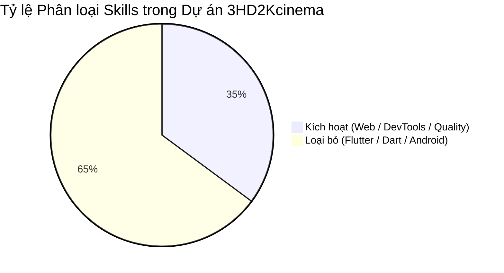

# Cấu hình & Quản lý Skills AI (AI Skills Configuration)

Tài liệu này chi tiết hóa quy trình **sàng lọc, phân loại và cấu hình bộ kỹ năng (Skills)** của AI Agent (Google Antigravity, Cursor, Copilot) tại repository **3HD2Kcinema**.

---

## 🎯 1. Mục đích Sàng lọc Skills

Hệ thống AI Agent sở hữu một kho kỹ năng mặc định rất rộng (gồm 37+ skills thuộc nhiều nền tảng khác nhau). Việc tải toàn bộ các skill này vào ngữ cảnh (Context) của repository Web Application gây ra hai vấn đề chính:

1. **Lãng phí Token (Token Waste)**: Đưa các prompt/quy tắc của Flutter, Dart hoặc Android vào ngữ cảnh dự án HTML/CSS/JS/C#.
2. **Nhiễu Ngữ cảnh (Context Noise)**: AI có thể đưa ra các giải pháp hoặc thư viện không tương thích (ví dụ: gợi ý widget Flutter cho trang web Vanilla JS).

Do đó, bộ cấu hình cục bộ tại `.agents/config.json` và `.agents/rules/01-skills-config.md` đã được thiết lập để **lọc chính xác 13 skills phù hợp** và **vô hiệu hóa 24 skills không liên quan**.

---

## 📊 2. Bảng Sàng lọc & Phân loại Skills (Skill Matrix)



### ✅ Kỹ năng Kích hoạt (Active Skills - 13 Skills)

| Tên Skill | Phân nhóm | Mô tả chức năng | Tác dụng đối với Dự án |
|---|---|---|---|
| [`modern-web-guidance`](file:///.agents/rules/01-skills-config.md) | Frontend | Guidance cho HTML5, CSS3, ES6 JS, Glassmorphism, animations. | Đảm bảo code UI tuân thủ chuẩn Web hiện đại, responsive mượt mà. |
| [`a11y-debugging`](file:///.agents/rules/01-skills-config.md) | Accessibility | Audit và debug khả năng truy cập theo chuẩn WCAG / web.dev. | Hỗ trợ kịch bản test `npm run test:a11y` với Playwright & Axe-core. |
| [`chrome-devtools`](file:///.agents/rules/01-skills-config.md) | Debugging | Kiểm tra DOM, Network inspection, Browser Automation qua MCP. | Phân tích và sửa lỗi runtime client-side trực tiếp trên trình duyệt. |
| [`debug-optimize-lcp`](file:///.agents/rules/01-skills-config.md) | Performance | Tối ưu chỉ số LCP và Core Web Vitals. | Tăng tốc độ hiển thị hình ảnh poster phim và giao diện đặt vé. |
| [`memory-leak-debugging`](file:///.agents/rules/01-skills-config.md) | Performance | Phát hiện leak bộ nhớ JS, event listeners rải rác. | Kiểm soát bộ nhớ cho tính năng khóa ghế `BroadcastChannel`. |
| [`troubleshooting`](file:///.agents/rules/01-skills-config.md) | DevTools | Sửa lỗi kết nối Chrome DevTools MCP server. | Đảm bảo kết nối ổn định giữa AI Agent và trình duyệt thử nghiệm. |
| [`antigravity-guide`](file:///.agents/rules/01-skills-config.md) | Antigravity | Tra cứu tài liệu, sitemap, cấu hình CLI/IDE/SDK Antigravity. | Giúp AI sử dụng thành thạo môi trường Google Antigravity. |
| [`google-antigravity-sdk`](file:///.agents/rules/01-skills-config.md) | AI SDK | Thiết kế và điều phối multi-agent systems. | Quản lý subagents làm việc song song. |
| [`ponytail`](file:///.agents/rules/01-skills-config.md) | Code Quality | Chuyển đổi level tối ưu hóa ponytail. | Ngăn ngừa việc viết code quá phức tạp. |
| [`ponytail-audit`](file:///.agents/rules/01-skills-config.md) | Code Quality | Audit toàn bộ repo để phát hiện code thừa. | Giữ cho codebase luôn sạch sẽ và gọn nhẹ. |
| [`ponytail-gain`](file:///.agents/rules/01-skills-config.md) | Code Quality | Đo lường lượng token và LOC đã tiết kiệm. | Theo dõi hiệu quả tối ưu hóa. |
| [`ponytail-help`](file:///.agents/rules/01-skills-config.md) | Code Quality | Tra cứu lệnh và cheat sheet ponytail. | Trợ giúp sử dụng bộ công cụ Ponytail. |
| [`ponytail-review`](file:///.agents/rules/01-skills-config.md) | Code Quality | Review code diff để ngăn over-engineering. | Áp dụng trong bước Post-Work Checklist. |

---

### ❌ Kỹ năng Loại bỏ (Disabled Skills - 24 Skills)

Các kỹ năng sau đã được đánh dấu vĩnh viễn không sử dụng trong dự án này:

1. **Mobile Native**: `android-cli` (Dự án không có mã nguồn ứng dụng Android Native).
2. **Browser Extension**: `chrome-extensions` (Dự án là ứng dụng Web App, không phải Chrome Extension).
3. **Flutter / Dart Ecosystem (22 Skills)**:
   - *Dart testing & analysis*: `dart-add-unit-test`, `dart-build-cli-app`, `dart-collect-coverage`, `dart-fix-runtime-errors`, `dart-generate-test-mocks`, `dart-migrate-to-checks-package`, `dart-resolve-package-conflicts`, `dart-run-static-analysis`, `dart-setup-ffi-assets`, `dart-use-ffigen`, `dart-use-pattern-matching`, `dart-use-primary-constructors`.
   - *Flutter UI & architecture*: `flutter-add-integration-test`, `flutter-add-widget-preview`, `flutter-add-widget-test`, `flutter-apply-architecture-best-practices`, `flutter-build-responsive-layout`, `flutter-fix-layout-issues`, `flutter-implement-json-serialization`, `flutter-setup-declarative-routing`, `flutter-setup-localization`, `flutter-use-http-package`.

---

## ⚙️ 3. Vị trí Cấu hình Cục bộ trong Repository

Các tệp tin cấu hình cục bộ được lưu trữ tại:

```text
web-application-development/
├── .agents/
│   ├── config.json                 # Tệp JSON tổng quan cấu hình skills & dự án
│   └── rules/
│       ├── 00-core-rules.md        # Các quy tắc phát triển cốt lõi cho AI Agent
│       ├── 01-skills-config.md     # Bảng quy định kích hoạt/loại bỏ Skills chi tiết
│       └── antigravity-rtk-rules.md # Quy tắc proxy RTK tiết kiệm token
├── .cursorrules                    # File cấu hình tương thích Cursor IDE & Copilot
└── docs/
    └── ai-skills-config.md         # Trang tài liệu MkDocs này
```

---

## 🚀 4. Hướng dẫn Kiểm tra & Cập nhật Config

Khi có nhu cầu thêm skill mới hoặc thay đổi trạng thái kích hoạt:

1. **Cập nhật `.agents/config.json`**: Thêm/bớt skill trong mảng `"active"` hoặc `"inactive"`.
2. **Cập nhật `.agents/rules/01-skills-config.md`**: Cập nhật bảng điều kiện kích hoạt.
3. **Đồng bộ Tài liệu**: Chạy `mkdocs serve` tại local để đảm bảo trang tài liệu này hiển thị đầy đủ thông tin.
