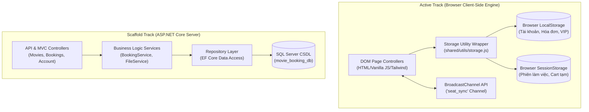

# Kiến trúc Hệ thống (Architecture)

Hệ thống **3HD2Kcinema** được thiết kế dựa trên nguyên lý phân tách trách nhiệm (Separation of Concerns). Tài liệu này trình bày chi tiết về sơ đồ tổng thể và hai luồng kiến trúc song song của hệ thống.

---

## 🏗️ Tổng quan Mô hình Song Song

Hệ thống duy trì hai đường lối phát triển:

1. **Client-Side Active Track**: Tầng ứng dụng giao diện chính hiện tại. Chạy hoàn toàn trên trình duyệt, không cần backend server, thích hợp cho việc demo, thử nghiệm UX/UI mượt mượt và cài đặt cực kỳ đơn giản.
2. **Full-Stack Target Track**: Khung ứng dụng ASP.NET Core C# cùng CSDL SQL Server, đóng vai trò nền tảng để mở rộng ứng dụng thành hệ thống doanh nghiệp sẵn sàng kết nối API trong tương lai.



---

## 🌐 1. Kiến trúc Phân tầng Frontend (Client-Side Engine)

Mã nguồn Frontend tại thư mục `frontend/src/` được tổ chức theo kiến trúc **Domain-Based / Feature-Based**, giúp mỗi trang hoặc nhóm chức năng tự quản lý giao diện và logic của mình.

### Sơ đồ luồng xử lý tại Frontend

```text
┌────────────────────────────────────────────────────────────────────────┐
│                        VIEW LAYER (HTML Pages)                         │
│  index.html | movie-details.html | booking.html | profile.html         │
└──────────────────────────────────┬─────────────────────────────────────┘
                                   │ Bắt sự kiện DOM (Click, Input, Scroll)
┌──────────────────────────────────▼─────────────────────────────────────┐
│                   CONTROLLER LAYER (*-ui.js / *.js)                    │
│  Render UI, Lắng nghe Sự kiện, Cập nhật trạng thái hiển thị            │
└──────────────────────────────────┬─────────────────────────────────────┘
                                   │ Gọi phương thức xử lý nghiệp vụ
┌──────────────────────────────────▼─────────────────────────────────────┐
│                    SERVICE LAYER (*Service.js)                         │
│  authService.js | bookingService.js                                    │
└─────────────────┬──────────────────────────────────────┬───────────────┘
                  │ Đồng bộ sự kiện đa tab               │ Đọc/Ghi dữ liệu
┌─────────────────▼──────────────┐      ┌────────────────▼───────────────┐
│ BroadcastChannel ('seat_sync') │      │ Storage Wrapper (storage.js)   │
└────────────────────────────────┘      └────────────────┬───────────────┘
                                                         │
                                        ┌────────────────┴───────────────┐
                                        │ LocalStorage & SessionStorage  │
                                        └────────────────────────────────┘
```

### Các nguyên tắc thiết kế Frontend:
- **ES6 Modules**: Mã JS được phân chia thành các tệp module rõ ràng (`<script type="module">`), không sử dụng biến toàn cục bừa bãi.
- **Single Source of Truth cho Storage**: Mọi thao tác lưu trữ dữ liệu đều phải đi qua `frontend/src/shared/utils/storage.js`.
- **Đồng bộ thời gian thực**: Sử dụng `BroadcastChannel` với tên kênh `seat_sync` để truyền phát các gói tin sự kiện khóa ghế giữa các trình duyệt đang mở cùng lúc.

---

## ⚙️ 2. Kiến trúc Tầng Backend (ASP.NET Core Scaffold)

Tầng Backend được thiết kế theo mô hình chuẩn **Layered Architecture** kết hợp **Repository Pattern**.

### Chi tiết các lớp Backend:

```text
backend/
├── Controllers/
│   ├── AccountController.cs    # Đăng nhập, Đăng ký, Cookie Auth
│   ├── BookingsController.cs   # Tạo hóa đơn, kiểm tra ghế trống
│   ├── MoviesController.cs     # CRUD Phim, danh sách suất chiếu
│   ├── SeatsController.cs      # Trạng thái sơ đồ ghế
│   └── UploadsController.cs    # Quản lý file ảnh poster upload
├── Services/
│   ├── BookingService.cs       # Logic tính tiền, giảm giá, khóa ghế DB
│   └── FileService.cs          # Lưu trữ file tải lên máy chủ
├── Repositories/
│   ├── GenericRepository.cs    # Thao tác CRUD tổng quát với EF Core
│   └── BookingRepository.cs    # Query dữ liệu đặt vé phức tạp
├── Models/
│   ├── User.cs, Movie.cs       # Các thực thể C# (Entities)
│   ├── Booking.cs, Seat.cs     # Mối quan hệ 1-n, n-n
│   └── ApplicationDbContext.cs # Entity Framework DbContext
└── Infrastructure/
    └── DbInitializer.cs        # Cơ chế Seeding nạp dữ liệu phim JSON ban đầu
```

### Nguyên tắc xử lý nghiệp vụ Backend:
1. **Controllers**: Tiếp nhận HTTP Request, kiểm tra Model Validation và chuyển giao cho Service.
2. **Services**: Chịu trách nhiệm thực hiện các quy tắc nghiệp vụ (Business Rules), tính toán hệ số điểm VIP, áp mã giảm giá.
3. **Repositories**: Tương tác trực tiếp với `ApplicationDbContext` để đọc/ghi dữ liệu SQL Server, cách ly hoàn toàn câu lệnh LINQ/EF Core khỏi Controller.
