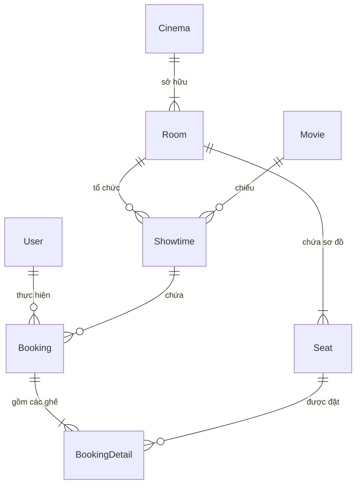

# Chi tiết Mã nguồn Backend

Tài liệu này trình bày chi tiết về cấu trúc mã nguồn, các lớp thực thể (Entities), cơ chế quản lý dữ liệu và thiết kế kiến trúc mẫu ASP.NET Core C# trong hệ thống 3HD2Kcinema.

---

## 🛠️ Công nghệ Sử dụng ở Backend

- **Framework**: ASP.NET Core 8.0 MVC & Web API.
- **ORM**: Entity Framework Core 8.0.
- **Database**: SQL Server / LocalDB.
- **Authentication**: Cookie Authentication & Session Management.
- **API Documentation**: Swagger / Swashbuckle OpenAPI.

---

## 📁 Cấu trúc Thư mục `backend/`

Mã nguồn được tổ chức theo chuẩn phân tầng Enterprise ASP.NET Core:

```text
backend/
├── Controllers/
│   ├── AccountController.cs    # Đăng nhập, đăng ký, đăng xuất, cookie auth
│   ├── BookingsController.cs   # Xử lý tạo đơn đặt vé, hóa đơn & chi tiết đặt ghế
│   ├── MoviesController.cs     # API & View xem danh sách phim, chi tiết phim
│   ├── SeatsController.cs      # Truy vấn sơ đồ ghế theo phòng chiếu & suất chiếu
│   ├── UploadsController.cs    # Xử lý lưu trữ và phân phối tệp hình ảnh
│   └── HomeController.cs       # Điều hướng trang chủ MVC
├── Models/
│   ├── User.cs                 # Entity tài khoản khách hàng / quản trị
│   ├── Movie.cs                # Entity thông tin bộ phim
│   ├── Cinema.cs               # Entity cụm rạp chiếu phim
│   ├── Room.cs                 # Entity phòng chiếu thuộc rạp
│   ├── Seat.cs                 # Entity vị trí ghế ngồi cố định
│   ├── Showtime.cs             # Entity suất chiếu lịch rạp
│   ├── Booking.cs              # Entity hóa đơn thanh toán
│   ├── BookingDetail.cs        # Entity chi tiết ghế của từng hóa đơn
│   └── ApplicationDbContext.cs # EF Core DbContext cấu hình quan hệ & chỉ mục
├── Repositories/
│   ├── IGenericRepository.cs   # Interface thao tác CRUD chung
│   ├── GenericRepository.cs    # Triển khai thao tác CSDL bất đồng bộ (async)
│   ├── IBookingRepository.cs   # Interface chuyên biệt cho nghiệp vụ Đặt vé
│   └── BookingRepository.cs    # SQL Query kiểm tra ghế trống & khóa ghế
├── Services/
│   ├── IBookingService.cs      # Interface xử lý nghiệp vụ đặt vé
│   ├── BookingService.cs       # Logic tính giá tiền, giảm giá VIP, hoàn ghế
│   ├── IFileService.cs         # Interface quản lý file
│   └── FileService.cs          # Lưu trữ ảnh poster phim tải lên
├── Infrastructure/
│   └── DbInitializer.cs        # Khởi tạo DB & Nạp dữ liệu JSON mẫu (Seeding)
├── DataSeeding/
│   └── movies.json             # File dữ liệu phim gốc ban đầu
├── Program.cs                  # File điểm vào (Entry Point), cấu hình Dependency Injection
└── appsettings.json           # File cấu hình chuỗi kết nối SQL Server & logging
```

---

## 🗄️ Mô hình Thực thể (EF Core Entities)

Các thực thể trong `backend/Models/` đại diện cho các bảng trong SQL Server:



### Các lớp Entity chính

- **`User`**: Id, FullName, Email, PasswordHash, Role (`Customer` / `Admin`), LoyaltyPoints, Tier.
- **`Movie`**: Id, Title, Description, Director, DurationMinutes, ReleaseDate, PosterUrl, TrailerUrl, Rating.
- **`Showtime`**: Id, MovieId, RoomId, StartTime, EndTime, TicketPrice.
- **`Booking`**: Id, UserId, ShowtimeId, BookingDate, TotalAmount, Status (`Paid` / `Cancelled`), QRCode.
- **`BookingDetail`**: Id, BookingId, SeatId, Price.

---

## 🔒 Cơ chế Khóa Ghế & Chống Đặt Trùng (Concurrency Control)

Ở tầng CSDL SQL Server, bảng `booking_details` được thiết lập chỉ mục duy nhất (Unique Index) trên cặp thuộc tính `{ ShowtimeId, SeatId }`:

```csharp
builder.Entity<BookingDetail>()
    .HasIndex(bd => new { bd.ShowtimeId, bd.SeatId })
    .IsUnique();
```

!!! warning "Ngăn chặn Race Condition"
    Nếu có hai giao dịch thanh toán đồng thời (Concurrent Transactions) gửi lên cho cùng một ghế tại một suất chiếu, SQL Server sẽ chặn giao dịch thứ hai và ném ngoại lệ `DbUpdateException`. Tầng `BookingService` sẽ bắt ngoại lệ này và trả về thông báo lỗi "Ghế đã bị người khác đặt" cho Client.

---

## 🌱 Cơ chế Nạp dữ liệu Tự động (DbInitializer)

Khi ứng dụng khởi chạy trong `Program.cs`, phương thức `DbInitializer.Initialize(context)` được gọi:

1. Kiểm tra xem CSDL `movie_booking_db` đã tồn tại chưa (`context.Database.EnsureCreated()`).
2. Nếu chưa có dữ liệu phim, hệ thống tự động đọc tệp `DataSeeding/movies.json`.
3. Chuyển đổi dữ liệu JSON thành danh sách thực thể `Movie` và lưu vào SQL Server qua EF Core.
