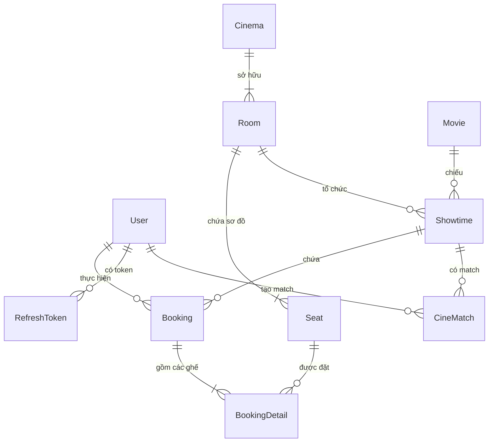

# Chi tiết Mã nguồn Backend

Tài liệu này trình bày chi tiết về cấu trúc mã nguồn, các lớp thực thể (Entities), cơ chế quản lý dữ liệu và thiết kế kiến trúc ASP.NET Core 8 trong hệ thống **3HD2Kcinema**.

> **Xem thêm**: [Backend Workflow Details](backend-workflow-details.md) để biết chi tiết luồng hoạt động, API endpoints, và khoảng cách Schema vs Implementation.

---

## 🛠️ Công nghệ Sử dụng ở Backend

- **Framework**: ASP.NET Core 8.0 Web API.
- **ORM**: Entity Framework Core 8.0 (Code-First, SQL Server).
- **Database**: SQL Server (hosted trên somee.com).
- **Real-time**: SignalR (WebSocket) cho chọn ghế, chat, mini-game.
- **Authentication**: JWT Bearer + Refresh Token + 2FA OTP.
- **API Documentation**: Swagger / Swashbuckle OpenAPI.
- **Caching**: IMemoryCache (cho RatingService).
- **Background Services**: HostedService (SeatCleanupService).

---

## 📁 Cấu trúc Thư mục `backend/`

Mã nguồn được tổ chức theo chuẩn phân tầng ASP.NET Core:

```text
backend/
├── Controllers/
│   ├── AuthController.cs            # Đăng ký, đăng nhập, 2FA, refresh token, JWT
│   ├── ApiBookingsController.cs    # Tạo đơn đặt vé (logic inline, không qua Service)
│   ├── ApiMoviesController.cs      # CRUD phim + ratings (OMDb API)
│   ├── ApiShowtimesController.cs   # CRUD suất chiếu
│   ├── ApiCinemasController.cs     # CRUD rạp chiếu
│   ├── ApiCombosController.cs      # CRUD combo bắp nước
│   ├── ApiVouchersController.cs    # CRUD voucher/mã giảm giá
│   ├── ApiUsersController.cs       # Quản lý tài khoản người dùng
│   ├── ApiCineMatchController.cs   # REST API cho CineMatch mini-game
│   ├── ApiGroupBookingController.cs # Đặt vé nhóm (in-memory)
│   ├── ApiPaymentController.cs     # Thanh toán QR (VietQR) + Webhook
│   ├── ApiSettingsController.cs    # Cấu hình động (key-value)
│   └── UploadsController.cs        # Upload ảnh (FileService)
├── Models/
│   ├── User.cs                     # Entity tài khoản (BCrypt, OTP, 2FA, VIP, Points)
│   ├── Movie.cs                    # Entity phim (Director, Cast, Gallery, BackdropUrl)
│   ├── Cinema.cs                   # Entity cụm rạp chiếu
│   ├── Room.cs                     # Entity phòng chiếu
│   ├── Seat.cs                     # Entity ghế (Status, HeldByUserId, HeldUntil, RowVersion)
│   ├── Showtime.cs                 # Entity suất chiếu (TicketPrice, denormalized fields)
│   ├── Booking.cs                  # Entity hóa đơn (Seats string, PaymentStatus)
│   ├── BookingDetail.cs            # Entity chi tiết ghế (Unique Index {ShowtimeId, SeatId})
│   ├── Combo.cs                    # Entity combo (string Id, Price, Stock)
│   ├── Voucher.cs                  # Entity voucher (DiscountType, MinOrderAmount, PointsRequired)
│   ├── CineMatch.cs                # Entity mini-game ghép đôi (RevealCode, IsRevealed)
│   ├── RefreshToken.cs             # Entity refresh token (JwtId, IsUsed, IsRevoked, ExpiryDate)
│   └── Setting.cs                  # Entity cấu hình động (Key-Value)
├── Hubs/
│   ├── SeatHub.cs                  # Chọn/giữ/giải phóng ghế real-time (optimistic concurrency)
│   ├── NotificationHub.cs          # Thông báo hệ thống (ReceiveNewBooking, DataUpdated)
│   ├── CineMatchHub.cs             # Mini-game ghép đôi (in-memory queue + rooms)
│   └── SupportChatHub.cs           # Live chat hỗ trợ (guest + admin)
├── Repositories/
│   ├── BookingRepository.cs        # CRUD Booking
│   ├── MovieRepository.cs          # CRUD Movie
│   ├── ShowtimeRepository.cs      # CRUD Showtime
│   ├── UserRepository.cs           # CRUD User
│   ├── CinemaRepository.cs         # CRUD Cinema
│   ├── ComboRepository.cs          # CRUD Combo
│   └── VoucherRepository.cs        # CRUD Voucher
├── Services/
│   ├── IFileService.cs             # Interface upload/delete ảnh
│   ├── FileService.cs              # Lưu ảnh vào wwwroot/uploads/images/ (5MB, GUID+Ticks)
│   ├── IRatingService.cs           # Interface lấy rating phim
│   ├── RatingService.cs            # Gọi OMDb API + cache 24h + hash fallback
│   ├── IPayOSService.cs            # Interface thanh toán PayOS
│   ├── PayOSService.cs             # Logic gọi API PayOS tạo mã QR
│   └── SeatCleanupService.cs       # BackgroundService dọn ghế hết hạn (30s, Held → Available)
├── Infrastructure/
│   ├── ApplicationDbContext.cs     # EF Core DbContext (13 DbSet, indexes, FK config)
│   └── DbInitializer.cs            # EnsureCreated + seed 11 phim mẫu
├── Migrations/                     # 7 migration files (SeatRealTime, Auth, Combos, Vouchers, v.v.)
├── Program.cs                      # Entry point: DI, JWT, SignalR, RateLimiter, CORS, Middleware
└── appsettings.json               # Cấu hình: ConnectionString, JWT, SMTP, Payment
```

---

## 🗄️ Mô hình Thực thể (EF Core Entities)

Các thực thể trong `backend/Models/` đại diện cho các bảng trong SQL Server:


```mermaid
erDiagram
    User ||--o{ Booking : "thực hiện"
    User ||--o{ RefreshToken : "có token"
    Showtime ||--o{ Booking : "chứa"
    Booking ||--|{ BookingDetail : "gồm các ghế"
    Seat ||--o{ BookingDetail : "được đặt"
    Cinema ||--|{ Room : "sở hữu"
    Room ||--|{ Seat : "chứa sơ đồ"
    Room ||--o{ Showtime : "tổ chức"
    Movie ||--o{ Showtime : "chiếu"
    User ||--o{ CineMatch : "tạo match"
    Showtime ||--o{ CineMatch : "có match"
```

### Các lớp Entity chính

- **`User`** (`users`): UserId, Fullname, Email, Phone, Password (BCrypt), Role (CUSTOMER/VIP/ADMIN), IsVerifiedOtp, IsTwoFactorEnabled, AvatarUrl, OtpCode, OtpExpiryTime, VipPlan, Points, AccessFailedCount, LockoutEnd, LastOtpRequestTime.
- **`Movie`** (`Movies`): Id, Title, Description, Duration, AgeRating, Genre, PosterUrl, BackdropUrl, TrailerUrl, ReleaseDate, Status, Director, Cast, Language, Gallery.
- **`Showtime`** (`Showtimes`): Id, MovieId, RoomId, StartTime, EndTime, CinemaId, CinemaName, RoomName, MovieTitle (denormalized), TicketPrice.
- **`Booking`** (`bookings`): Id, UserId, ShowtimeId, MovieId, Seats (comma-separated string), TotalPrice, PaymentMethod, PaymentStatus, CreatedAt.
- **`BookingDetail`** (`booking_details`): Id, BookingId, ShowtimeId, SeatId, Price. — **Unique Index** `{ShowtimeId, SeatId}`.
- **`Seat`**: Id, RoomId, SeatRow, SeatNumber, SeatType, Status (Available/Held/Booked), HeldByUserId, HeldUntil, RowVersion ([Timestamp]).
- **`Combo`** (`combos`): Id (string), Name, Desc, Price, Stock, Image, Category.
- **`Voucher`**: Id, Code, Description, DiscountType (PERCENTAGE/FIXED), DiscountValue, MinOrderAmount, MaxDiscountAmount, ExpiryDate, IsActive, PointsRequired.
- **`CineMatch`** (`cinematches`): Id, UserId, ShowtimeId, SeatId, AdjacentSeatId, MatchPreference, MatchedUserId, Status (pending/matched), RevealCode, IsRevealed, CreatedAt.
- **`RefreshToken`** (`refresh_tokens`): Id, Token, JwtId, IsUsed, IsRevoked, UserId, AddedDate, ExpiryDate.
- **`Setting`** (`settings`): Key, Value.

---

## 🔒 Cơ chế Kiểm soát Đồng thời (Concurrency Control)

Hệ thống có **2 lớp** kiểm soát đồng thời khi chọn ghế:

### Lớp 1: Optimistic Concurrency (SeatHub - Real-time)

Entity `Seat` có thuộc tính `RowVersion` với attribute `[Timestamp]`:

```csharp
// Seat.cs
[Timestamp]
public byte[]? RowVersion { get; set; }
```

Khi 2 user cùng gọi `SeatHub.SelectSeat` cho cùng một ghế:
1. User A: `SaveChangesAsync` thành công → `RowVersion` thay đổi.
2. User B: `SaveChangesAsync` ném `DbUpdateConcurrencyException` (vì `RowVersion` đã đổi).
3. SeatHub catch exception → gửi `SeatSelectionFailed` cho User B.

```csharp
try
{
    await _dbContext.SaveChangesAsync();
    await Clients.Group(roomId).SendAsync("SeatSelected", seatIdStr, userId);
}
catch (DbUpdateConcurrencyException)
{
    await Clients.Caller.SendAsync("SeatSelectionFailed", seatIdStr, "Seat was taken by someone else.");
}
```

### Lớp 2: Unique Index (BookingDetail - Database)

```csharp
// ApplicationDbContext.cs
entity.HasIndex(e => new { e.ShowtimeId, e.SeatId }, "UQ_Seat_Per_Showtime").IsUnique();
```

- Đảm bảo tại một suất chiếu, một ghế chỉ xuất hiện trong một `BookingDetail` duy nhất.
- Nếu 2 transaction cùng insert `BookingDetail` cho `{ShowtimeId, SeatId}` giống nhau, SQL Server sẽ chặn request thứ hai.

> **[Schema vs Implementation]** Schema định nghĩa `BookingDetail` với Unique Index, nhưng `ApiBookingsController` hiện tại **chưa sử dụng** `BookingDetail` — ghế được lưu dạng chuỗi trong `Booking.Seats`. Xem [Backend Workflow Details - Section 9](backend-workflow-details.md#9-ghi-chú-kỹ-thuật--khoảng-cách-schema) để biết chi tiết.

---

## 🌱 Cơ chế Nạp dữ liệu Tự động (DbInitializer)

Khi ứng dụng khởi chạy trong `Program.cs` (nếu `Database:InitializeOnStartup = true`):

1. `context.Database.EnsureCreated()` — tạo DB nếu chưa tồn tại.
2. Nếu bảng `Movies` trống → chèn **11 phim mẫu** (GUID cố định, trailer YouTube, `now-showing` / `coming-soon`).
3. Lưu vào SQL Server qua EF Core.

> **Lưu ý**: `DbInitializer` chỉ seed **Movies** — không seed Cinemas hay Rooms.

---

## 🔧 Cấu hình Dependency Injection (Program.cs)

```csharp
// Repositories - Scoped
builder.Services.AddScoped<UserRepository>();
builder.Services.AddScoped<MovieRepository>();
builder.Services.AddScoped<BookingRepository>();
// ... (Showtime, Cinema, Combo, Voucher)

// Services
builder.Services.AddScoped<IFileService, FileService>();
builder.Services.AddScoped<IRatingService, RatingService>();
builder.Services.AddScoped<IPayOSService, PayOSService>();
builder.Services.AddHttpClient();      // Cho OMDb API
builder.Services.AddMemoryCache();     // Cho RatingService cache 24h

// Background Service - Singleton
builder.Services.AddHostedService<SeatCleanupService>();

// SignalR
builder.Services.AddSignalR();

// JWT Authentication
builder.Services.AddAuthentication(JwtBearerDefaults.AuthenticationScheme)
    .AddJwtBearer(options => { /* TokenValidationParameters + SignalR query string */ });

// Rate Limiting
builder.Services.AddRateLimiter(options => {
    options.AddFixedWindowLimiter("loginPolicy", opt => { /* 5 req/phút */ });
});

// CORS
builder.Services.AddCors(options => {
    options.AddPolicy("AllowAll", policy => /* AllowAnyOrigin/Method/Header */ );
});
```

---

## 📡 SignalR Hubs

| Hub | Endpoint | Auth | Mô tả |
|-----|----------|------|-------|
| `SeatHub` | `/seatHub` | [Authorize] | Chọn/giữ/giải phóng ghế real-time |
| `NotificationHub` | `/notificationHub` | — | Thông báo hệ thống (qua IHubContext từ Controllers) |
| `CineMatchHub` | `/cinematchHub` | [Authorize] | Mini-game ghép đôi (in-memory) |
| `SupportChatHub` | `/supportChatHub` | — | Live chat hỗ trợ (guest + admin) |

---

## ⚙️ Background Services

### SeatCleanupService

- Chạy mỗi **30 giây**.
- Tìm ghế `Status == "Held" && HeldUntil < DateTime.UtcNow`.
- Reset về `Available`, gửi `SeatReleased` qua SignalR.

---

> **Tài liệu chi tiết hơn**: Xem [Backend Workflow Details](backend-workflow-details.md) để biết đầy đủ luồng hoạt động, API endpoints, cấu hình, và ghi chú kỹ thuật.