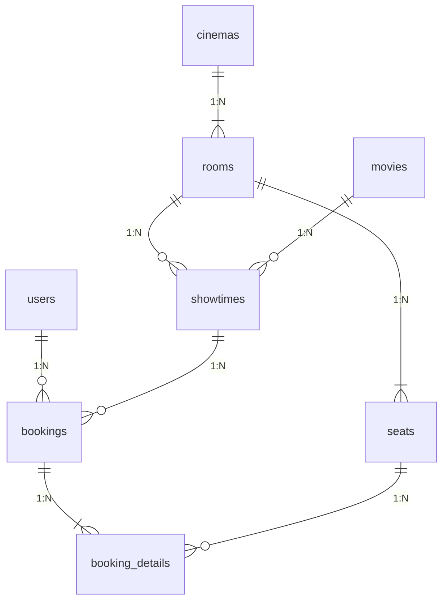

# Cơ sở Dữ liệu (Database Schema)

Hệ thống 3HD2Kcinema áp dụng chiến lược lưu trữ kép: **Client-side Mock Storage** (dành cho bản chạy Frontend chính thức) và **SQL Server Relational Database** (dành cho khung kết nối Backend).

---

## 📱 1. Client-Side Browser Storage (Mock DB Engine)

Mọi thao tác đọc/ghi dữ liệu trình duyệt được đóng gói tập trung tại `frontend/src/shared/utils/storage.js` nhằm đảm bảo an toàn dữ liệu và tránh lỗi phân tích JSON.

### SessionStorage (Dữ liệu tạm thời theo phiên làm việc)

| Key Name | Cấu trúc Dữ liệu (Schema) | Mục đích sử dụng |
|---|---|---|
| `cinema_current_user` | `{ id, fullName, email, role, loyaltyPoints, vipTier }` | Lưu thông tin người dùng đang đăng nhập trong phiên làm việc hiện tại. |
| `cinema_checkout` | `{ movieId, showtimeId, seats: [], combos: [], totalPrice }` | Lưu thông tin giỏ hàng tạm thời khi chuyển từ trang chọn ghế sang trang thanh toán. |

### LocalStorage (Dữ liệu lưu trữ bền vững)

| Key Name | Cấu trúc Dữ liệu (Schema) | Mục đích sử dụng |
|---|---|---|
| `cinema_users` | `Array<UserObject>` | Danh sách toàn bộ tài khoản người dùng đăng ký trong rạp. |
| `cinema_bookings` | `Array<BookingObject>` | Lịch sử tất cả các hóa đơn đặt vé đã thanh toán thành công. |
| `cinema_seat_locks` | `{ [showtimeId]: { [seatId]: { userId, expiresAt } } }` | Danh sách các ghế đang bị tạm khóa thời gian thực. |
| `3hd2k_rewards` | `{ points: number, history: Array<PointTransaction> }` | Số điểm tích lũy và lịch sử biến động điểm thưởng. |
| `3hd2k_notifications` | `Array<NotificationObject>` | Danh sách tin nhắn thông báo (mua vé, hủy vé, cộng điểm). |
| `3hd2k_rewards_processed` | `Array<bookingId>` | Danh sách các Booking ID đã tính điểm (chống cộng trùng điểm khi reload trang). |

---

## 🗄️ 2. SQL Server Relational Database (Backend Scaffold)

Tên Database mặc định: `movie_booking_db`

### Sơ đồ Bảng & Thực thể (Database Tables)

### Bảng 1: `users`

Lưu trữ tài khoản người dùng hệ thống.

- `Id` (INT, PK, Auto Increment)
- `Email` (NVARCHAR(100), Unique, Not Null)
- `PasswordHash` (NVARCHAR(MAX), Not Null)
- `FullName` (NVARCHAR(100), Not Null)
- `Role` (NVARCHAR(20), Default: 'Customer')
- `LoyaltyPoints` (INT, Default: 0)

### Bảng 2: `movies`

Lưu danh mục bộ phim.

- `Id` (INT, PK, Auto Increment)
- `Title` (NVARCHAR(200), Not Null)
- `Director` (NVARCHAR(100))
- `DurationMinutes` (INT, Not Null)
- `PosterUrl` (NVARCHAR(500))
- `TrailerUrl` (NVARCHAR(500))

### Bảng 3: `showtimes`

Lưu lịch chiếu phim.

- `Id` (INT, PK, Auto Increment)
- `MovieId` (INT, FK -> `movies.Id`)
- `RoomId` (INT, FK -> `rooms.Id`)
- `StartTime` (DATETIME2, Not Null)
- `TicketPrice` (DECIMAL(18,2), Not Null)

### Bảng 4: `bookings`

Lưu hóa đơn đặt vé.

- `Id` (INT, PK, Auto Increment)
- `UserId` (INT, FK -> `users.Id`)
- `ShowtimeId` (INT, FK -> `showtimes.Id`)
- `BookingDate` (DATETIME2, Default: GETDATE())
- `TotalAmount` (DECIMAL(18,2), Not Null)
- `Status` (NVARCHAR(20), Default: 'Paid')
- `QRCode` (NVARCHAR(100))

### Bảng 5: `booking_details`

Chi tiết ghế của từng đơn hàng.

- `Id` (INT, PK, Auto Increment)
- `BookingId` (INT, FK -> `bookings.Id`)
- `SeatId` (NVARCHAR(10), Not Null)
- `Price` (DECIMAL(18,2), Not Null)
- **Unique Constraint**: `{ ShowtimeId, SeatId }` — Đảm bảo một ghế không thể bị đặt 2 lần tại cùng 1 suất chiếu.
