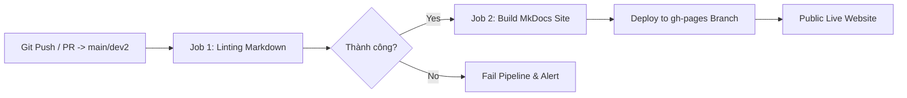

# Triển khai Hệ thống (Deployment Guide)

Tài liệu này hướng dẫn quy trình triển khai tự động tài liệu (MkDocs Material trên GitHub Pages) cũng như quy trình triển khai ứng dụng Frontend và Backend lên các môi trường Cloud.

---

## 📚 1. Triển khai Tài liệu (MkDocs Material + GitHub Pages)

Dự án được cấu hình tự động triển khai trang web tài liệu khi có commit mới đẩy lên nhánh `main` hoặc `dev2`.

### Cơ chế Tự động hóa qua GitHub Actions Workflow

File cấu hình workflow đặt tại: `.github/workflows/docs.yml`



### Các bước thực hiện thủ công (Manual Deploy):

Nếu bạn muốn deploy tài liệu thủ công từ máy cá nhân lên GitHub Pages:

```bash
# 1. Cài đặt các công cụ phụ thuộc
pip install mkdocs-material

# 2. Chạy lệnh deploy tự động tạo nhánh gh-pages
mkdocs gh-deploy --force
```

---

## 🌐 2. Triển khai Frontend (Client-side Web App)

Vì Frontend của 3HD2Kcinema là một Static Web Application (HTML, CSS, Vanilla JS), ứng dụng đã được triển khai chính thức trên nền tảng **Vercel**:

👉 **Trực tuyến tại**: [https://32dk-web-app-project.vercel.app](https://32dk-web-app-project.vercel.app)

### Dịch vụ khuyên dùng:
- **Vercel**: Tích hợp liên tục với GitHub Repo. Cấu hình root directory thành `frontend/src`.
- **Netlify**: Đặt Build Command là rỗng (`none`) và Publish Directory là `frontend/src`.
- **GitHub Pages**: Đặt thư mục nguồn là `/frontend/src`.

#### File Cấu hình `vercel.json` mẫu:
```json
{
  "version": 2,
  "public": true,
  "builds": [
    { "src": "frontend/src/**", "use": "@vercel/static" }
  ],
  "routes": [
    { "src": "/(.*)", "dest": "/frontend/src/$1" }
  ]
}
```

---

## ⚙️ 3. Triển khai Backend (ASP.NET Core Scaffold)

Đối với phần máy chủ ASP.NET Core và SQL Server:

### Môi trường Docker Container

Bạn có thể đóng gói Backend bằng `Dockerfile`:

```dockerfile
FROM mcr.microsoft.com/dotnet/sdk:8.0 AS build
WORKDIR /app
COPY backend/*.csproj ./backend/
RUN dotnet restore backend/*.csproj
COPY backend/ ./backend/
RUN dotnet publish backend/*.csproj -c Release -o /out

FROM mcr.microsoft.com/dotnet/aspnet:8.0 AS runtime
WORKDIR /app
COPY --from=build /out .
EXPOSE 80
ENTRYPOINT ["dotnet", "backend.dll"]
```

### Lệnh chạy Docker:
```bash
docker build -t 3hd2kcinema-backend .
docker run -d -p 5000:80 --name cinema-backend 3hd2kcinema-backend
```
