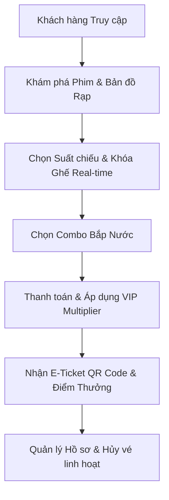

# Tổng quan Hệ thống 3HD2Kcinema

Chào mừng đến với tài liệu kỹ thuật chính thức của **3HD2Kcinema** — Hệ thống đặt vé xem phim trực tuyến hiện đại.


---

## 💡 Giới thiệu Dự án

**3HD2Kcinema** mô phỏng toàn bộ quy trình trải nghiệm rạp chiếu phim từ góc nhìn của khách hàng: từ duyệt danh sách phim, tìm kiếm & lọc suất chiếu, định vị rạp gần nhất, giữ ghế thời gian thực, chọn combo bắp nước đến thanh toán, nhận vé E-ticket có QR code và quản lý điểm thưởng VIP.

Dự án được xây dựng với chiến lược **Mô hình Song song Hai tầng Kiến trúc**:

1. **Frontend (Tầng Chạy Thực tế - Client-Side Engine)**: 
    - Xây dựng hoàn toàn bằng **HTML5, CSS3, Vanilla JS (ES6 Modules)** và **Tailwind CSS**.
    - Sử dụng **LocalStorage & SessionStorage** đóng vai trò CSDL giả lập (Mock DB) để ứng dụng có thể chạy độc lập, mượt mà mà không phụ thuộc vào máy chủ backend.
    - Tích hợp **BroadcastChannel API** để đồng bộ hóa trạng thái giữ ghế thời gian thực giữa các tab trình duyệt.
2. **Backend (Tầng Kiến trúc Mẫu - Full-Stack Scaffold)**:
    - Xây dựng bằng **ASP.NET Core MVC & Web API (C#)** kết hợp **Entity Framework Core** và **SQL Server**.
    - Đóng vai trò làm bộ khung (scaffold) chuẩn mực cho giai đoạn kết nối tích hợp dữ liệu trung tâm trong tương lai.

---

## 🌟 Điểm nổi bật & Tính năng cốt lõi



- 🎟️ **Đặt ghế Real-time**: Khóa ghế tạm thời 15 phút, giải phóng ghế tự động khi đóng tab và đồng bộ qua BroadcastChannel `seat_sync`.
- 🍿 **Đặt Combo Đồ ăn**: Menu cuộn ngang responsive mượt mượt trên mọi kích thước di động.
- 💎 **Hệ thống VIP & Loyalty**: Tự động áp dụng hệ số nhân điểm cao nhất (Silver 1.2x, Gold 1.5x, Platinum 2.0x, Tier VIP/Diamond lên đến 2.0x).
- 📍 **Định vị Cụm rạp**: HTML5 Geolocation API kết hợp bản đồ Leaflet để tính khoảng cách thực tế đến các rạp 3HD2K gần nhất.
- 🔄 **Hủy vé Linh hoạt**: Cho phép hủy toàn bộ hoặc từng phần vé ngay tại trang Hồ sơ, tự động hoàn ghế lại sơ đồ rạp.
- 🎮 **Minigame Cinebet**: Dự án giải trí sau credit phim giúp người dùng đặt cược tích lũy thêm điểm thưởng.

---

## 📁 Cấu trúc Cây Thư mục Dự án

```text
3HD2Kcinema/
├── README.md                  # Hướng dẫn tổng quan & khởi chạy nhanh
├── LICENSE                    # Giấy phép bản quyền MIT
├── .gitignore                 # Danh sách file/thư mục bỏ qua khi commit
├── mkdocs.yml                 # Cấu hình website tài liệu MkDocs Material
├── .markdownlint.yml          # Quy tắc kiểm tra định dạng Markdown
├── .github/
│   └── workflows/
│       └── docs.yml           # GitHub Actions tự động lint và deploy docs
├── docs/                      # Thư mục chứa toàn bộ tài liệu Markdown
│   ├── index.md               # Trang chủ tài liệu (File này)
│   ├── getting-started.md     # Hướng dẫn khởi chạy Frontend & Backend
│   ├── architecture.md        # Kiến trúc tổng thể Client-side & ASP.NET Core
│   ├── frontend.md            # Chi tiết mã nguồn & UI/UX Frontend
│   ├── backend.md             # Chi tiết mã nguồn & ORM Backend C#
│   ├── api.md                 # Danh sách RESTful APIs & Client Mock Services
│   ├── database.md            # Cấu trúc LocalStorage & Schema SQL Server
│   ├── deployment.md          # Hướng dẫn triển khai GitHub Pages, Vercel, Docker
│   ├── testing.md             # Kịch bản kiểm thử E2E Playwright & Manual Test
│   ├── contributing.md        # Quy trình đóng góp & Quy ước Git Commit
│   └── ai-contribution.md     # Quy tắc & Checklist dành cho AI Agents
├── frontend/                  # Mã nguồn ứng dụng Client-side
│   └── src/                   # Thư mục mã nguồn chính (auth, booking, explore, user,...)
└── backend/                   # Khung ứng dụng ASP.NET Core C# (Scaffold)
```

---

## 🚀 Lộ trình Đọc Tài liệu

Để nắm bắt nhanh dự án, bạn nên tham khảo tài liệu theo trình tự đề xuất sau:

1. [Khởi chạy (Getting Started)](getting-started.md): Thiết lập môi trường và chạy ứng dụng local.
2. [Kiến trúc Hệ thống (Architecture)](architecture.md): Thấu hiểu mô hình Client-side Mock vs Backend Scaffold.
3. [Chi tiết Frontend](frontend.md) & [Backend](backend.md): Khám phá cấu trúc mã nguồn chi tiết.
4. [API](api.md) & [Database](database.md): Tra cứu các data schemas và endpoints.
5. [Quy trình Đóng góp](contributing.md) & [AI Agent Guide](ai-contribution.md): Quy định cho lập trình viên và AI.
